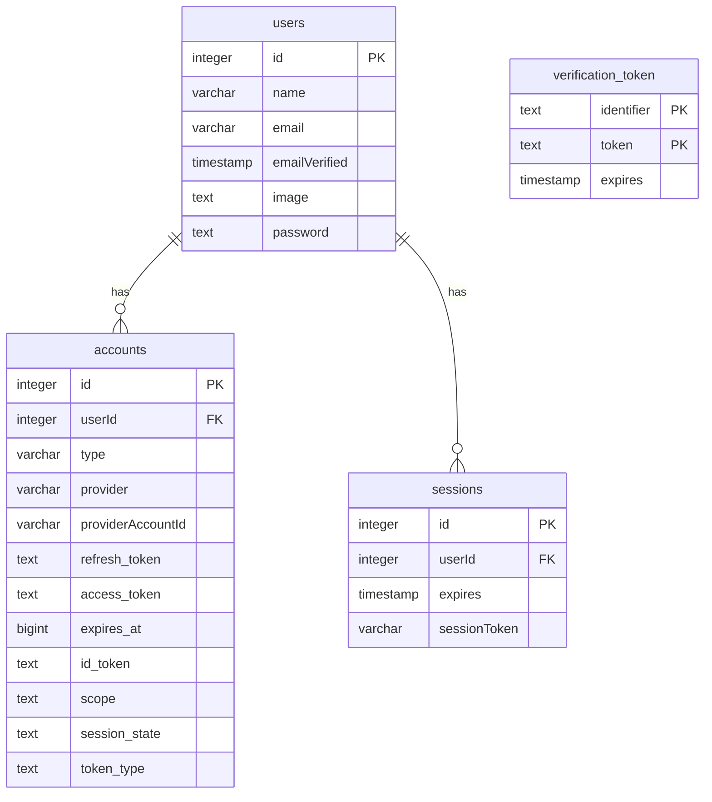

# Database Schema

## Entity Relationship Diagram



## SQL Definitions

```sql
CREATE TABLE verification_token
(
  identifier TEXT NOT NULL,
  expires TIMESTAMPTZ NOT NULL,
  token TEXT NOT NULL,
 
  PRIMARY KEY (identifier, token)
);
 
CREATE TABLE accounts
(
  id SERIAL,
  "userId" INTEGER NOT NULL,
  type VARCHAR(255) NOT NULL,
  provider VARCHAR(255) NOT NULL,
  "providerAccountId" VARCHAR(255) NOT NULL,
  refresh_token TEXT,
  access_token TEXT,
  expires_at BIGINT,
  id_token TEXT,
  scope TEXT,
  session_state TEXT,
  token_type TEXT,
 
  PRIMARY KEY (id)
);
 
CREATE TABLE sessions
(
  id SERIAL,
  "userId" INTEGER NOT NULL,
  expires TIMESTAMPTZ NOT NULL,
  "sessionToken" VARCHAR(255) NOT NULL,
 
  PRIMARY KEY (id)
);
 
CREATE TABLE users
(
  id SERIAL,
  name VARCHAR(255),
  email VARCHAR(255),
  "emailVerified" TIMESTAMPTZ,
  image TEXT,
  password TEXT,
 
  PRIMARY KEY (id)
);
```